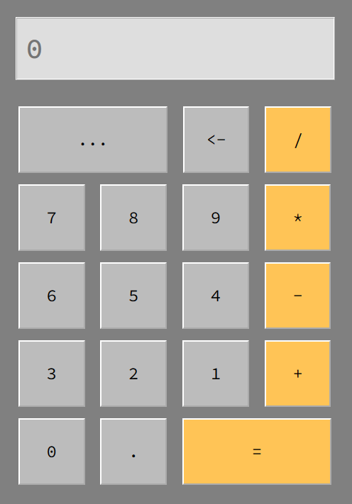

# Calculator

This is a simple calculator project made with HTML and Javascript. Here is the link, https://jbrosdevelopment.github.io/Calculator



# Embed code

```html
<iframe src="https://jbrosdevelopment.github.io/Calculator" width="405px" height="580px" frameborder="0" title="Calculator"></iframe>
```